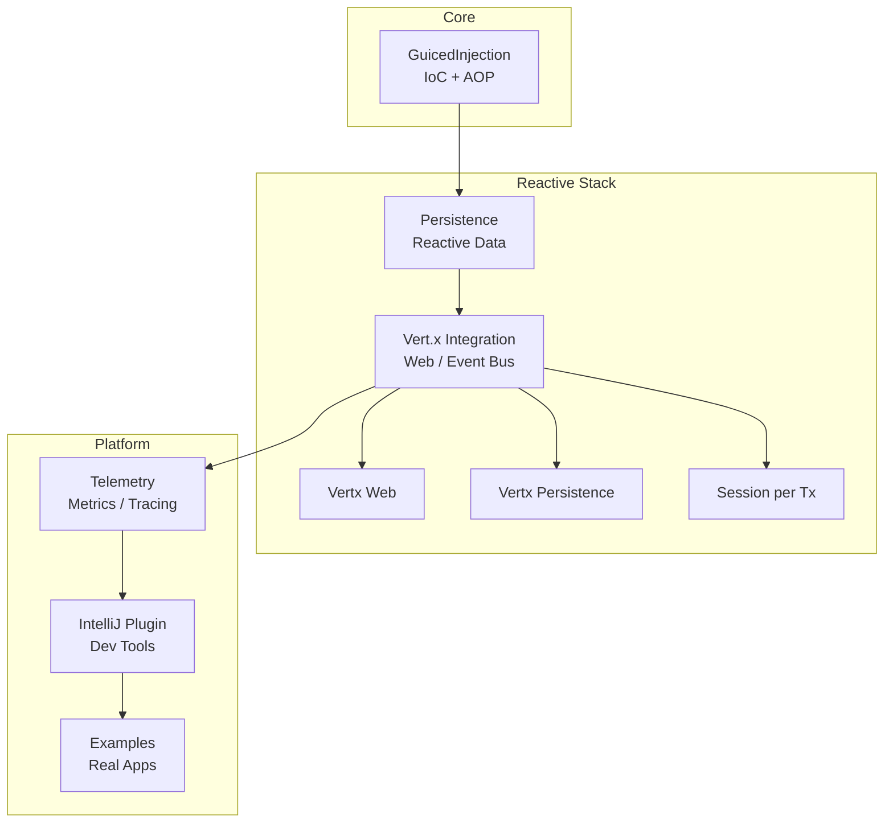

# 🧩 GuicedEE Framework

> *Modern Modular Java — Human-Centric, Fast, and Fearlessly Simple.*

[](https://github.com/GuicedEE/GuicedEE/actions)
[](https://openjdk.org/projects/jdk/25/)
[](https://maven.apache.org/)
[](https://vertx.io/)
[](#)
[](LICENSE)
[](https://github.com/GuicedEE/GuicedEE/discussions)

---

### 👋 Welcome

GuicedEE is a **Level-3 modular Java framework** built on **Guice** and **Vert.x 5**, engineered for modern, cloud-native applications.
It is designed to be **fast, transparent, and vendor-neutral**, using **JPMS modules**, **service loaders**, and **post-injection AOP** to deliver true modularity — without the weight of traditional enterprise stacks.

> This project isn’t about reinventing Java EE — it’s about rediscovering *clarity and craft* in Java software design.

---

## ✅ Requirements

- **JDK 25+**
- **Maven 3.9.1+**

---

## ✨ Why GuicedEE?

- **100% JPMS-compliant:** Real modular builds with `module-info.java`
- **Reactive by default:** Built on Vert.x 5 and Hibernate Reactive 7
- **Dependency-light:** Uses Guice for IoC, no fat-JARs, no vendor lock-in
- **Cross-module injection:** via service loaders + custom Guice bindings
- **Cloud-native runtime:** JLink images for minimal, secure deployments
- **Community-driven:** open, modular, and friendly
- **Version-managed:** via [`guicedee-bom`](https://github.com/GuicedEE/guicedee-bom)

---

## ⚡ Quick Start

```bash
git clone https://github.com/GuicedEE/GuicedEE.git
cd GuicedEE
mvn clean install
```

Add it to your project (versions are managed by the BOM):

```xml
<dependencyManagement>
  <dependencies>
    <dependency>
      <groupId>com.guicedee</groupId>
      <artifactId>guicedee-bom</artifactId>
      <type>pom</type>
      <scope>import</scope>
    </dependency>
  </dependencies>
</dependencyManagement>

<dependencies>
  <dependency>
    <groupId>com.guicedee</groupId>
    <artifactId>guicedee</artifactId>
  </dependency>
</dependencies>
```

---

## 🧬 The GuicedEE Ecosystem

> *Each module builds on the one before it — a living chain of modular components.*

| Chain | Description |
|-------|--------------|
| [](https://github.com/GuicedEE/GuicedInjection) | Foundation IoC and AOP layer |
| ➡️ [](https://github.com/GuicedEE/Persistence) | Reactive database and entity management |
| ➡️ [](https://github.com/GuicedEE/Guiced-Vert.x) | Vert.x 5 reactive core integration |
| ➡️ [](https://github.com/GuicedEE/GuicedVertxWeb) | HTTP routing, handlers, middleware |
| ➡️ [](https://github.com/GuicedEE/GuicedVertxPersistence) | Reactive DB helpers for Vert.x |
| ➡️ [](https://github.com/GuicedEE/GuicedVertxSessionPerTransaction) | Session-per-transaction strategy |
| ➡️ [](https://github.com/GuicedEE/GuicedTelemetry) | Metrics, tracing, and OpenTelemetry |
| ➡️ [](https://github.com/GuicedEE/GuicedVertxSockets) | WS/SSE integration |
| ➡️ [](https://github.com/GuicedEE/WebSockets) | Jakarta WebSocket layer |
| ➡️ [](https://github.com/GuicedEE/RestServices) | REST scaffolding |
| ➡️ [](https://github.com/GuicedEE/Servlets) | Jakarta Servlet integrations |
| ➡️ [](https://github.com/GuicedEE/Undertow) | Undertow server bindings |
| ➡️ [](https://github.com/GuicedEE/OpenAPI) | OpenAPI codegen |
| ➡️ [](https://github.com/GuicedEE/SwaggerUI) | Swagger UI packaging |
| ➡️ [](https://github.com/GuicedEE/Hazelcast) | Distributed caching |
| ➡️ [](https://github.com/GuicedEE/Hazelcast-Hibernate) | Hibernate L2 cache |
| ➡️ [](https://github.com/GuicedEE/GuicedRabbit) | Messaging adapters |
| ➡️ [](https://github.com/GuicedEE/GuicedEEIntelliJPlugin) | Developer experience tools |
| ➡️ [](https://github.com/GuicedEE/Examples) | Real-world implementations and demos |

> Also see: **[ai-rules](https://github.com/GuicedEE/ai-rules)** — a curated set of prompt/rule files to auto-assist IDE AI agents (Junie / Copilot / Claude) when working with GuicedEE.

---

## 🏗️ Architecture at a Glance



---

## 🤝 Contributing

We believe in *open craftsmanship*.
If you’re exploring GuicedEE, contributing docs, or experimenting with reactive modules — you’re already part of the family.

- 💬 [Start a discussion](https://github.com/GuicedEE/GuicedEE/discussions)
- 🪶 [Report an issue](https://github.com/GuicedEE/GuicedEE/issues)
- 🧩 [Read the rules](https://github.com/GuicedEE/junie-guides/blob/master/RULES.md)
- 🤖 [AI setup helpers](https://github.com/GuicedEE/ai-rules)

---

## 🪴 Our Philosophy

> “We design, document, and build together.”

GuicedEE exists to make modular Java human again — approachable, performant, and precise.
We value clarity over cleverness, and community over control.

---

## 📜 License

Apache License 2.0  
See [LICENSE](LICENSE) for full text.

---

🪄 *Built with Guice. Powered by Vert.x. Designed with intent.*